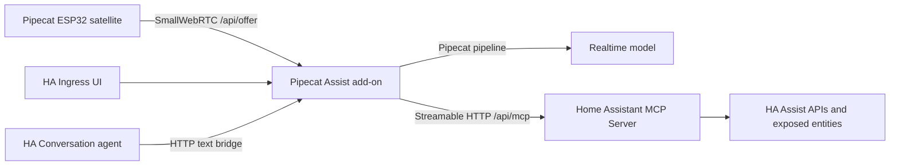

# Pipecat Home Assistant

Pipecat Home Assistant is a Home Assistant app repository for a realtime,
multimodal assistant built on [Pipecat](https://github.com/pipecat-ai/pipecat).
The project replaces the synchronous Assist audio path with a Pipecat WebRTC
session while keeping Home Assistant device control through the native Home
Assistant MCP server.

## What is included

- `addons/pipecat_assist` - the Home Assistant app/add-on. It runs Pipecat,
  exposes a configuration UI through Ingress, serves `/api/offer` for
  Pipecat ESP32 SmallWebRTC clients, and connects to Home Assistant MCP.
- `custom_components/pipecat_assist` - a small Home Assistant conversation
  entity that forwards text requests into the add-on, so existing HA
  conversation entry points can select "Pipecat Realtime".
- `.github/workflows` - CI and GHCR publishing workflows for multi-arch Home
  Assistant images.

## Architecture



## Quick start

1. Add this repository to Home Assistant as an app/add-on repository.
2. Install **Pipecat Assist**.
3. In the add-on configuration set:
   - `openai_api_key`
   - `runner_host` to the Home Assistant LAN IP used by ESP32 devices
   - `satellite_shared_secret` to a long random value
4. Enable Home Assistant's **Model Context Protocol Server** integration.
5. Start the add-on and open the web UI.
6. Build Pipecat ESP32 firmware with the generated
   `PIPECAT_SMALLWEBRTC_URL`.

The add-on uses `SUPERVISOR_TOKEN` when `homeassistant_api: true` is enabled.
If that token is not accepted by your MCP configuration, use a Home Assistant
long-lived access token in `longlived_token`.

## Pipecat ESP32

Pipecat ESP32 expects a SmallWebRTC offer endpoint:

```bash
export PIPECAT_SMALLWEBRTC_URL="http://<home-assistant-lan-ip>:7860/api/offer?token=<satellite-secret>"
```

This repository intentionally keeps the ESP32 firmware separate for now. The
next step is to integrate Pipecat ESP32 into ESPHome so the device side and the
Home Assistant add-on become one ecosystem.

## Development

The add-on source is in `addons/pipecat_assist`.

```bash
python -m compileall addons/pipecat_assist/app custom_components/pipecat_assist
```

For a container build:

```bash
docker build -t pipecat-assist:dev addons/pipecat_assist
```

## References

- Pipecat: https://github.com/pipecat-ai/pipecat
- Pipecat ESP32: https://github.com/pipecat-ai/pipecat-esp32
- Home Assistant MCP server: https://www.home-assistant.io/integrations/mcp_server/
- Home Assistant app docs: https://developers.home-assistant.io/docs/apps/configuration/

